# Hubble research architecture

**Status:** accepted for phased implementation  
**Date:** 2026-08-27  
**Decision owner:** Outlio

## Implementation status — 2026-08-27

Phase A is implemented and live against the configured Supabase project:

- Hubble's `research_runs` and `research_job_queue` own production scheduling.
- The MCP exposes stateless `research_lead`; Hubble does not create a second MCP job.
- MCP facts normalize into `research_evidence`, and cleaned documents normalize
  into company-shared `hubble_pages`/`hubble_chunks`.
- Fresh sourced `research_evidence` rows also enter retrieval as citation-ready
  passages, so typed contact/company facts participate in RAG without a repeat
  crawl. Person-answer caching is isolated by lead; page reuse remains shared
  by company.
- Active-run idempotency, recent exact-fact deduplication, and page content-hash
  reuse prevent duplicate work and rows.
- Persisted stages and bounded evidence gaps are returned by the run API and
  shown by the Intelligence polling UI.
- Migration `0064_hubble_research_consolidation.sql` is applied.

Phase B/C channel expansion remains gated by provider-specific contract tests
and terms/privacy review. Meilisearch remains a capacity-triggered option, not
an installed dependency.

## 1. Decision

Hubble will not install all nine candidate repositories. They solve different
problems and several overlap with systems Outlio already has. Running them
together would create duplicate crawlers, queues, indexes, credentials, and LLM
reasoning loops.

Hubble will use this stack:

1. Keep `services/web-research-mcp` as the single public-web acquisition MCP:
   operator-owned SearXNG discovery with DuckDuckGo HTML fallback, bounded HTTP fetches, Cheerio parsing,
   deterministic extraction, relevance scoring, and Gemini semantic extraction.
2. Adopt Agent-Reach's **channel registry, ordered fallback, and health-check
   pattern**, but do not install its whole runtime or copy browser cookies into
   the SaaS.
3. Adopt MindSearch's **query decomposition and bounded parallel research graph**,
   but implement it inside Hubble's existing TypeScript planner instead of
   deploying a second Python/LLM orchestration service.
4. Keep Supabase/Postgres as the authoritative database, job queue, evidence
   store, and initial retrieval engine.
5. Keep Meilisearch as the only approved future external retrieval index. Add it
   only when a benchmark proves Postgres is the bottleneck, and make it a
   rebuildable read model rather than a source of truth.
6. Do not adopt xfetch, browser-use, Elasticsearch, Gigablast, RediSearch, or
   Hister in the production research path.

This is an evidence engine, not a promise to operate a zero-cost copy of the
whole public web. Hubble discovers public sources, retains the useful evidence
it has read, and reuses that evidence for every lead at the same company.

## 2. Repository decisions

| Repository | What it actually provides | Decision | Hubble use |
| --- | --- | --- | --- |
| [Agent-Reach](https://github.com/Panniantong/Agent-Reach) | A capability layer over channel-specific tools, with ordered backends and diagnostics | **Adopt pattern only** | `ChannelProvider` registry, capability probes, explicit degradation |
| [xfetch](https://github.com/Panniantong/xfetch) | Cookie-authenticated X/Twitter collection, session and proxy handling | **Reject for SaaS** | No shared cookies, session farms, anti-detection, or proxy rotation |
| [browser-use](https://github.com/browser-use/browser-use) | LLM-driven Playwright browser automation | **Reject from automatic path** | Direct HTTP remains first; the existing bounded browser renderer is sufficient. Reconsider only for operator diagnostics after a measured coverage gap |
| [Elasticsearch](https://github.com/elastic/elasticsearch) | Distributed full-text, vector, analytics, and observability platform | **Reject at current scale** | Too much operational and memory cost for a zero-charge MVP; duplicates Postgres/Solr/Meili roles |
| [Gigablast](https://github.com/gigablast/open-source-search-engine) | Full crawler and distributed web search engine | **Reject** | A stale, infrastructure-heavy web crawler is the wrong reliability and cost profile |
| [MindSearch](https://github.com/InternLM/MindSearch) | Multi-agent query planning and concurrent web-search reasoning | **Adopt design ideas only** | A bounded research DAG inside Hubble; no second frontend, Python API, or LLM loop |
| [Meilisearch](https://github.com/meilisearch/meilisearch) | Fast full-text and hybrid application search | **Conditional future adoption** | The one optional secondary evidence index, enabled only by capacity thresholds |
| [RediSearch](https://github.com/RediSearch/RediSearch) | Redis-integrated full-text/vector indexing | **Reject** | Adds an in-memory data system and another failure domain; standalone RediSearch is no longer released |
| [Hister](https://github.com/asciimoo/hister) | Private search over a user's browsing history and local files | **Reject** | Wrong ingestion model and duplicates Hubble's page/chunk corpus and MCP interface |

No listed repository verifies a phone number or email address by itself. Those
are facts produced by the extraction, validation, provenance, and corroboration
pipeline described below.

## 3. Target architecture

```mermaid
flowchart LR
  UI[Outlio UI / Hubble] --> API[Research API]
  API --> CACHE{Fresh answer or evidence?}
  CACHE -->|yes| ANSWER[Grounded answer]
  CACHE -->|no| QUEUE[(Postgres research queue)]

  QUEUE --> PLAN[Intent router + bounded research DAG]
  PLAN --> REG[Channel provider registry]
  REG --> WEB[SearXNG primary / DuckDuckGo HTML fallback]
  REG --> PUBLIC[Official site / RSS / GitHub / public media]
  REG -. explicit tenant connector only .-> SOCIAL[Restricted social connector worker]

  WEB --> FETCH[HTTP fetcher]
  PUBLIC --> FETCH
  SOCIAL --> NORM[Evidence normalizer]
  FETCH -->|rare bounded fallback| RENDER[Existing browser renderer]
  FETCH --> PARSE[Cheerio cleaner + code extractors]
  RENDER --> PARSE
  PARSE --> NORM

  NORM --> SCORE[Relevance + source quality]
  SCORE --> LLM[Gemini semantic extraction]
  SCORE --> MERGE[Fact merger]
  LLM --> MERGE
  MERGE --> DB[(Postgres facts + pages + chunks)]
  DB --> RETRIEVE[Lexical / optional vector retrieval]
  RETRIEVE --> ANSWER
  DB -. threshold-triggered write-behind .-> MEILI[(Optional Meilisearch read index)]
  MEILI -. IDs and ranked passages .-> RETRIEVE
```



### One owner for each responsibility

| Responsibility | Owner |
| --- | --- |
| User request, authorization, progress | Next.js server routes |
| Durable scheduling, leases, retry, dead letter | Existing `research_job_queue` in Postgres |
| Query plan and budgets | Hubble planner |
| Search and public-page collection | Web Research MCP |
| HTML parsing and cheap entity extraction | Cheerio and deterministic TypeScript code |
| Semantic interpretation | Gemini, after filtering and chunking |
| Canonical facts and provenance | `research_evidence` |
| Open-ended page/passages | `hubble_pages` and `hubble_chunks` |
| Answer cache | `hubble_answers` |
| Optional high-scale passage ranking | Meilisearch, never authoritative |

The MCP's separate `web_research_jobs` queue and full-result bundle must not
become a second production source of truth. During integration, Hubble owns the
durable run and invokes stateless MCP tools (or the bounded synchronous
`research_run` on a sleeping free host). Results are normalized into Hubble's
existing evidence tables. The standalone MCP job tables may remain for local
testing, but Hubble production should not enqueue the same research in both
systems.

## 4. End-to-end research flow

### 4.1 Cache-first request

1. Resolve the canonical company by normalized domain. Multiple leads at the
   same company share cached pages and company facts.
2. Check the typed fact store and `hubble_answers` before any external request.
3. Return fresh, sufficient evidence immediately.
4. If evidence is missing, create or join one idempotent research run keyed by
   `(tenant, company, requested fields, plan version, time window)`.
5. The browser receives a job ID and progress; a long research run never holds a
   page request open.

### 4.2 Plan as a bounded DAG

The intent router converts a request into only the required nodes. For example,
"find the VP Sales email and current pain points" creates these nodes:

```text
identity/domain
  ├── official pages ──► public contacts
  ├── person/company queries ──► public profile evidence
  ├── hiring + product + recent-news queries ──► business signals
  └── existing evidence ──► gap analysis
                                  │
                                  ▼
                         cited pain-point inference
```

Nodes have prerequisites, deadlines, provider allow-lists, and satisfaction
conditions. When the requested fields are sufficiently supported, remaining
nodes are cancelled. The planner may generate queries, but it cannot grant a
provider more calls than the server-side policy permits.

### 4.3 Channel registry

Every source implements one small contract:

```ts
interface ChannelProvider {
  id: string
  capabilities: Array<'search' | 'fetch' | 'transcript' | 'profile'>
  access: 'public' | 'tenant_credential' | 'operator_only'
  health(): Promise<ProviderHealth>
  collect(task: ChannelTask, budget: ProviderBudget): Promise<EvidenceEnvelope[]>
}
```

Each `EvidenceEnvelope` includes canonical URL, title, published/fetched dates,
channel, source tier, content hash, collection method, and text or extracted
fields. Provider-specific payloads stop at this boundary.

Initial production providers:

- `web.searxng`: operator-owned no-meter search provider.
- `web.ddg_html`: HTML fallback when SearXNG is unavailable; challenges fail closed.
- `web.official`: same-domain pages, sitemaps, and public contact/about/careers
  pages found from the company domain.
- `rss.public`: company newsroom/blog feeds.
- `github.public`: public organization/repository evidence when relevant.
- `youtube.public`: public metadata/transcripts only when relevant and allowed.

Restricted social channels are off by default. LinkedIn, X, Instagram, and
Facebook must not use shared server-side browser cookies. A future connector
requires explicit tenant authorization, encrypted tenant-scoped credentials,
an isolated worker pool, a narrow domain allow-list, revocation, audit logs,
rate limits, and a terms/privacy review. Failure of a social connector produces
an explicit evidence gap; it never triggers CAPTCHA bypass or an account farm.

### 4.4 Fetch, parse, and extract

For each selected URL:

1. Canonicalize it, remove tracking parameters, and deduplicate it.
2. Reuse cached content when the URL and content hash are fresh.
3. Enforce public HTTP(S), DNS and redirect SSRF checks, response-size limits,
   timeouts, retries with jitter, and per-domain concurrency.
4. Fetch directly first. Use the existing browser renderer only for a measured
   JavaScript-rendering failure, with a hard per-run cap.
5. Cheerio removes scripts, styles, navigation, ads, forms, cookie UI, and
   repeated boilerplate. Store cleaned text, never raw HTML.
6. Code extracts email strings, phone strings, URLs, dates, currencies, social
   links, JSON-LD, domain matches, and obvious company/person matches.
7. Relevance and source-quality scoring discard weak pages before Gemini.
8. Chunk only the strongest passages and send the minimum necessary context to
   Gemini for semantic fields such as pain points, technology, buying signals,
   and personalization.

### 4.5 Fact model and proof

Every stored fact must carry:

```text
tenant_id, company_id, lead_id (optional)
field, normalized_value, display_value
source_url, source_title, published_at, fetched_at
source_tier, collection_method, content_hash
status, confidence, conflict_group
first_seen_at, last_seen_at, expires_at
```

Source tiers:

1. Official company site, government/regulatory record.
2. Reputable publication or named primary interview.
3. Public first-party social profile or repository.
4. Directory, review site, blog, or aggregator.
5. Model inference.

Independent agreement raises confidence. Conflicting values remain as separate
facts in one `conflict_group`; the UI shows the conflict instead of silently
choosing one.

Contact status rules:

| Status | Meaning |
| --- | --- |
| `verified` | Confirmed by an authoritative owner/source or a separate permitted verification step |
| `publicly_found` | Printed on a public fetched source; not proof the inbox/line is active |
| `inferred` | Pattern-derived candidate; always labeled as inferred |
| `not_found` | The bounded research plan found no support |

Email code validates syntax and domain/MX evidence; phone code normalizes with a
phone-number library and country context. Neither operation upgrades a contact
to `verified` by itself. Guessed contact information is never presented as
verified.

Pain points and buying signals are evidence-backed interpretations. They remain
`estimated` unless a source states them directly, and they retain the fact IDs
and passages used to derive them.

## 5. Load and latency controls

### Default no-charge research budget

| Limit | Default | Hard ceiling |
| --- | ---: | ---: |
| Generated queries | 4 | 8 |
| Results per query | 5 | 10 |
| Unique candidate URLs | 10 | 25 |
| Concurrent direct fetches | 4 | 8 |
| Per-domain concurrency | 1 | 2 |
| Browser-rendered pages | 0 | 2 |
| Gemini calls | 2 | 4 |
| Clean text per page | 50 KB | 100 KB |
| Interactive deadline | 12 s | 15 s |
| Background run deadline | 90 s | 180 s |

The interactive path performs cache lookup and may complete a tiny, fast plan.
Everything else is queued. Worker concurrency is controlled globally and per
tenant; the UI polls/subscribes to persisted progress. A free host that sleeps
uses bounded request-mode execution and must never report a queued job that has
no active worker.

### Stampede and duplication protection

- One in-flight run per idempotency key; later callers join it.
- One cached page per `(tenant, canonical URL)` and company-shared page reuse.
- Content hashes prevent re-chunking unchanged pages.
- Fact identity uses `(tenant, subject, field, normalized value, source URL)`.
- Write evidence in batches, not one database request per fact.
- Refresh stale material asynchronously; serve fresh-enough cached evidence
  while a refresh runs.
- Apply tenant quotas and global circuit breakers before external calls.

## 6. Retrieval decision and Meilisearch gate

Postgres full-text search remains the default because Hubble already has a GIN
index over cleaned chunks, optional embeddings, RLS-aware ownership, backups,
and no additional service to operate.

Meilisearch is added only if a representative benchmark shows at least one of:

- more than 1,000,000 active Hubble chunks;
- passage-search p95 above 200 ms for seven days;
- database CPU above 60% with retrieval identified as the cause; or
- a required typo/facet/hybrid feature cannot meet its SLO in Postgres.

If enabled:

- Postgres remains canonical.
- An outbox/write-behind worker indexes document IDs, tenant/company filters,
  searchable text, dates, quality, and optional vectors.
- Every query is tenant-filtered using a server-held key; clients never receive
  an unrestricted index key.
- Index lag is measured, failed writes retry, and the index is rebuildable.
- Meilisearch failure falls back to Postgres.
- Solr, Elasticsearch, RediSearch, and Hister are not run alongside it.

## 7. Failure behavior

| Failure | User-visible behavior |
| --- | --- |
| DuckDuckGo challenge or rate limit | Fail closed, use fresh cache or another approved public provider; never bypass the challenge |
| A page times out or is blocked | Record the failed URL and continue with remaining sources |
| Browser renderer unavailable | Continue with direct-fetch evidence and report the coverage gap |
| Gemini unavailable or free quota exhausted | Return deterministic facts and sources; omit semantic claims rather than inventing them |
| Social connector unavailable | Complete as web-only and label social coverage unavailable |
| Meilisearch unavailable | Retrieve from Postgres |
| Worker crash | Lease expires; Postgres requeues with bounded attempts and dead-letter reason |
| Conflicting sources | Preserve both claims and show the conflict |

## 8. No-charge operating mode

The software path can be configured to make **no metered vendor calls**:

- `OUTLIO_ALLOW_PAID_PROVIDERS=false` is enforced server-side.
- Paid provider adapters are absent from the eligible registry, not merely
  placed last.
- Gemini is used only with an unbilled/free-tier project and hard call ceilings;
  quota exhaustion degrades to code-only extraction.
- DuckDuckGo HTML, public pages, Postgres retrieval, and local/open-source tools
  remain the default path.
- No automatic proxy purchase, CAPTCHA service, phone/email enrichment vendor,
  Browser Use Cloud, Elastic Cloud, Redis Cloud, or Meilisearch Cloud.

### Contact Intelligence v2 — accepted implementation

The no-charge acquisition path now treats contact discovery as a dedicated
bounded workflow rather than one generic web query:

1. SearXNG runs inside the MCP Docker stack as the primary live metasearch;
   DuckDuckGo HTML remains the fail-closed fallback.
2. Email and phone tasks receive up to eight narrow queries and fourteen URL
   candidates; general research retains the smaller four-query/ten-URL budget.
3. The crawler reserves four URL slots for one-hop first-party
   team/about/leadership/contact discovery.
4. Code extracts ordinary and obfuscated email addresses, `mailto:`, `tel:`,
   JSON-LD contacts, international phones, and public profile URLs before a
   model sees the page.
5. Person association accepts omitted middle names and captured surname
   initials but still requires employer evidence. Independent hosts confirming
   the same value raise confidence.
6. Local Ollama structured extraction runs before optional Gemini. Neither
   model is allowed to invent contacts; deterministic evidence remains the
   contact authority.

This improves public-web recall but does not change the explicit non-goal:
non-public personal numbers, government identifiers, account credentials, and
guessed contact details are not collected.

Open-source licenses do not make compute free. A local Docker deployment can
avoid a vendor bill by using the user's hardware and network. Free cloud tiers
can sleep, throttle, change limits, or disappear; Hubble must treat that as an
availability trade-off, not claim perpetual free production capacity.

## 9. Phased implementation

### Phase A — consolidate the existing path

1. Make `research_runs` and `research_job_queue` the only Hubble production job
   authority.
2. Normalize MCP output into `research_evidence`, `hubble_pages`, and
   `hubble_chunks`; stop persisting a second full answer bundle in the main path.
3. Add company/request idempotency locks and content-hash deduplication.
4. Expose persisted stage progress and evidence gaps to the Intelligence UI.

**Exit gate:** repeated research for two leads at one company performs no
duplicate fetches and stores no duplicate facts.

### Phase B — provider registry and public channels

1. Add the typed `ChannelProvider` contract, registry, `health()` probes, and
   server-side budgets.
2. Register existing DuckDuckGo HTML and official-domain discovery.
3. Add public RSS, GitHub, and YouTube adapters only behind intent routing.
4. Add per-provider contract tests and challenge/rate-limit fixtures.

**Exit gate:** disabling any provider yields a deterministic degraded result;
no provider failure fails the whole run.

### Phase C — research DAG and stronger evidence

1. Extend the existing planner with typed DAG nodes, prerequisites,
   satisfaction conditions, and cancellation.
2. Add contact normalization/status rules, source tiers, conflict groups, and
   multi-source confidence.
3. Add cited pain-point/buying-signal inference and a model-off fallback.
4. Benchmark against a consented golden set of known leads.

**Exit gate:** every displayed important fact has a source; no inferred contact
is labeled verified; conflicts are visible.

### Phase D — scale gate, not a scheduled install

1. Measure corpus size, retrieval p50/p95, database CPU, queue time, cache hit
   rate, fetch success, and Gemini calls per completed run.
2. Run Postgres-versus-Meilisearch shadow benchmarks only after a threshold is
   crossed.
3. If Meilisearch wins materially, deploy it as the single write-behind read
   index and remove any Solr production dependency.

**Exit gate:** measured latency or feature improvement justifies its operational
cost and Postgres fallback remains tested.

### Phase E — optional social connector pilot

Proceed only after terms/privacy review and a user-consented credential design.
Pilot one provider, in an isolated worker, on a small tenant cohort. Do not use
xfetch or copied browser-cookie sessions as Hubble's default data source.

## 10. Acceptance metrics

- Answer cache hit rate and company-page reuse rate.
- Research queue wait time and end-to-end p50/p95.
- Queries, URLs, browser fallbacks, and Gemini calls per completed run.
- Public fetch success and challenge rate by provider/domain.
- Percentage of important facts with at least one source.
- Percentage corroborated by independent sources.
- Contact precision by `verified`, `publicly_found`, and `inferred` status.
- Conflict and stale-fact rate.
- Database rows/bytes added per company researched.
- Model-off completion rate for deterministic fields.
- Direct financial spend, which must remain zero in no-charge mode.

## 11. Explicit non-goals

- Crawling or indexing the whole web.
- Bypassing CAPTCHAs, paywalls, logins, robots controls, or access restrictions.
- Operating shared social-media accounts or cookie farms.
- Claiming every lead will have a verified phone number or email address.
- Calling every provider for every question.
- Running multiple full-text/vector indexes as parallel sources of truth.
